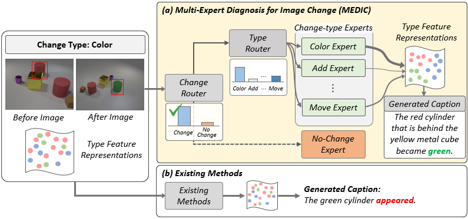
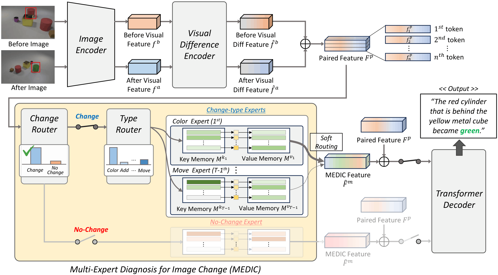
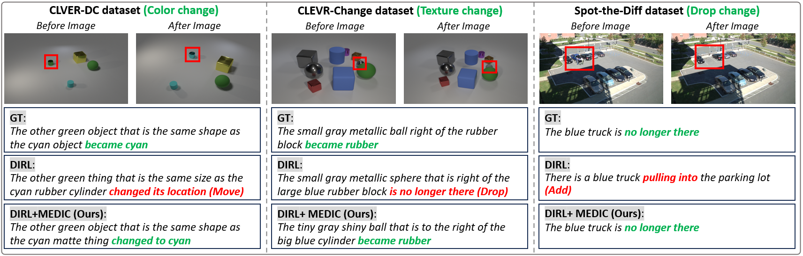
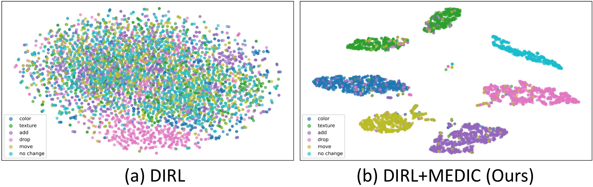
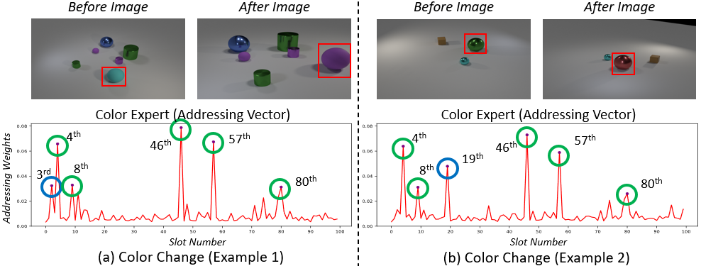

<h1>MEDIC</h1>
<h3>Different Changes Require Different Reasoning:<br>Change-Type-Specialized Experts for Robust Change Captioning</h3>

<a href="https://orcid.org/0009-0000-4212-7745"><strong>Jiyoung Park</strong></a><sup>1,*</sup>
· <a href="https://orcid.org/0009-0001-1321-3019"><strong>InJae Oh</strong></a><sup>1,*</sup>
· <a href="https://orcid.org/0000-0003-4533-4875"><strong>Jung Uk Kim</strong></a><sup>1,†</sup>

<sup>1</sup>Kyung Hee University, Yong-in, South Korea

<sup>*</sup> Equal contribution, <sup>†</sup> Corresponding author

Accepted to ECCV 2026!

<div align="center">

   
<!-- []()&nbsp; -->

<!-- []()&nbsp; -->

<!-- []() -->

</div>

---

## Table of Contents

* [Abstract](#abstract)
* [Overview](#overview)
* [Qualitative and Analytical Results](#qualitative-and-analytical-results)
* [Getting Started](#getting-started)
* [Data Preparation](#data-preparation)
* [Training and Evaluation](#training-and-evaluation)
* [Results](#results)
* [Plug-in Usage](#plug-in-usage)
* [Acknowledgement](#acknowledgement)
* [Citation](#citation)

## Abstract

Change captioning aims to generate natural language descriptions that explain semantic differences between a pair of images. Although different change types, such as color shifts, object additions, object removals, and spatial movements, require different visual evidence and reasoning processes, existing methods often process all changes through a single type-agnostic pipeline.

To address this limitation, we propose **Multi-Expert Diagnosis for Image Change (MEDIC)**, a change-type-aware framework for robust change captioning. MEDIC introduces a two-stage routing mechanism that first determines whether a meaningful change exists and then assigns the input to change-type-specialized experts. Each expert is implemented as a key-value memory network, enabling input-adaptive retrieval of type-relevant visual patterns. By explicitly modeling change-type diversity, MEDIC improves the precision and robustness of change descriptions across diverse datasets.

MEDIC is designed as a plug-in module and can be integrated into existing change captioning models. In our paper, we apply MEDIC to representative baselines including DIRL, SMART, and SCORER.

<div align="center">

</div>

## Overview

MEDIC consists of two main components:

1. **Two-stage router**
   The router first predicts whether a change exists and then estimates the distribution over change types.

2. **Change-type memory experts**
   Each expert is specialized for a specific change type and retrieves type-relevant visual patterns through a key-value memory network.

The current release provides the official implementation of **DIRL + MEDIC**. MEDIC is implemented as a plug-in module, and additional integrations for other baselines will be updated.

Current release:

* Core MEDIC module
* DIRL + MEDIC training and evaluation code
* Configurations for CLEVR-DC, CLEVR-Change, Spot-the-Diff, and Image Editing Request
* Evaluation scripts

## Qualitative Results

<div align="center">

</div>

## t-SNE Analysis

<div align="center">

</div>

## Memory Slot Activation

<div align="center">

</div>

## Getting Started

Follow the steps below to set up the environment and run MEDIC.

```bash
git clone https://github.com/VisualAIKHU/MEDIC.git
cd MEDIC
```

Create the environment:

```bash
  1. conda env create --file medic.yaml
  2. conda activate medic
  3. python -m spacy download en_core_web_sm
  4. conda install pytorch==2.4.0 torchvision==0.19.0 torchaudio==2.4.0 -c pytorch -y
  5. cd pycocoevalcap && python setup.py install
```

## Data Preparation

Please prepare each dataset following the original benchmark settings.

Supported datasets:

* CLEVR-DC
   * (https://github.com/hsgkim/clevr-dc)
   * before images: https://drive.google.com/file/d/1FeK--ilqYItdx6Fw6pLSWWNujylOovIT/view
   * after images: https://drive.google.com/file/d/1csIsr8IcwrOYAe-JAWQrcb3iu5RtaTK7/view
* CLEVR-Change
   * (https://github.com/Seth-Park/RobustChangeCaptioning)
* Spot-the-Diff
   * (https://github.com/harsh19/spot-the-diff) 
* Image Editing Request
   * (https://github.com/airsplay/VisualRelationships)

preprocess data:

```bash
  * process before images: python scripts/extract_features.py --input_image_dir /mnt/disk1/clevr_dc/images --output_dir /mnt/disk1/clevr_dc/features
  * process after images: python scripts/extract_features.py --input_image_dir /mnt/disk1/clevr_dc/sc_images --output_dir /mnt/disk1/clevr_dc/sc_features
  * Build vocab and training labels: python scripts/preprocess_captions_dc.py
  * Build GT annotations for evaluation: python utils/eval_utils_dc_std.py
```

The preprocessed dataset paths should be specified in the corresponding configuration files:

```text
configs/dynamic/transformer_medic_dc.yaml
configs/dynamic/transformer_medic_chg.yaml
configs/dynamic/transformer_medic_std.yaml
configs/dynamic/transformer_medic_ier.yaml
```

## Training and Evaluation

We provide training and evaluation code for DIRL + MEDIC.

### CLEVR-DC

```bash
bash run/run_dc_final.sh
```

### CLEVR-Change

```bash
bash run/run_chg_final.sh
```

### Spot-the-Diff

```bash
bash run/run_std_final.sh
```

The main training, testing, and evaluation scripts are organized as follows:

```text
train/
├── train_chg_final.py
└── train_dc_std_final.py

test/
├── test_chg_final.py
└── test_dc_std_final.py

eval/
├── evaluate_chg.py
├── evaluate_dc_std.py
└── evaluate_ier.py
```

## Results

### Single-change setting

| Method           | Dataset       |   BLEU-4 |   METEOR |  ROUGE-L |     CIDEr |    SPICE |
| ---------------- | ------------- | -------: | -------: | -------: | --------: | -------: |
| DIRL             | CLEVR-DC      |     51.4 |     32.3 |     66.3 |      84.1 |     16.8 |
| **DIRL + MEDIC** | CLEVR-DC      | **58.5** | **35.6** | **71.0** |  **99.8** | **20.0** |
| DIRL             | CLEVR-Change  |     56.2 |     41.0 |     73.8 |     126.0 |     33.1 |
| **DIRL + MEDIC** | CLEVR-Change  | **57.5** | **41.3** | **74.6** | **129.2** | **33.5** |
| DIRL             | Spot-the-Diff |     10.3 |     13.8 |     32.8 |      40.9 |     19.9 |
| **DIRL + MEDIC** | Spot-the-Diff | **11.1** | **14.6** | **33.7** |  **45.5** | **23.0** |

### Multi-change setting on Spot-the-Diff

| Method           |  BLEU-4 |   METEOR |  ROUGE-L |    CIDEr |    SPICE |
| ---------------- | ------: | -------: | -------: | -------: | -------: |
| DIRL             |     4.6 |      9.5 |     23.8 |     21.5 |     14.8 |
| **DIRL + MEDIC** | **6.8** | **11.2** | **26.7** | **31.2** | **20.1** |

## Plug-in Usage

MEDIC can be integrated into existing change captioning models that produce paired visual difference features.

```python
# paired visual difference feature from a baseline model
paired_feature = torch.cat([diff_before, diff_after], dim=-1)

# MEDIC module
medic_feature, routing_info = medic(paired_feature)

# feed the enhanced representation to the caption decoder
decoder_input = torch.cat([paired_feature, medic_feature], dim=-1)
caption = decoder(decoder_input)
```

## Repository Structure

```text
MEDIC/
├── configs/
│   ├── config_transformer_medic.py
│   └── dynamic/
├── datasets/
├── eval/
├── models/
├── run/
├── test/
├── train/
├── utils/
├── assets/
├── scheduler.py
├── README.md
└── requirements.txt
```

## Acknowledgement

This repository is built upon publicly available change captioning codebases.
We sincerely thank the authors of DIRL, SMART, and SCORER for releasing their implementations.
(https://github.com/tuyunbin)

## Citation

If you find this repository useful, please consider citing our paper.

```bibtex
@inproceedings{park2026medic,
  title={Different Changes Require Different Reasoning: Change-Type-Specialized Experts for Robust Change Captioning},
  author={Park, Jiyoung and Oh, InJae and Kim, Jung Uk},
  booktitle={European Conference on Computer Vision},
  year={2026}
}
```
